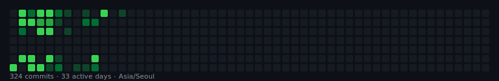

# sjr-ictk

**Audit Log · Backend**

 

&color=238636&style=for-the-badge&logo=github)

 

## 🌿 작업 잔디

**프로필에 보이는 GitHub 잔디와는 다른 그래프입니다** — 아래 표·SVG는 `ictk-solution-dev` audit-log 레포 커밋을 직접 모은 것입니다.

 

## 📊 활동 요약

<!--START_SECTION:activity-summary-->
<table>
  <tr>
    <td align="center"><strong style="font-size:1.4em">324</strong> commits</td>
    <td align="center"><strong style="font-size:1.4em">2</strong> repos</td>
    <td align="center"><strong style="font-size:1.1em">최근 1년</strong> Asia/Seoul</td>
  </tr>
</table>

마지막 갱신 · 2026. 5. 26. 오후 6:06
<!--END_SECTION:activity-summary-->

 

## 📁 레포별 · 월별

<!--START_SECTION:recent-commits-->
| 레포 | 커밋 |
|:------|-----:|
| `on-device-audit-log-manager` | **213** |
| `on-device-audit-log-server` | **111** |
| **합계** | **324** |

| 월 | on-device-audit-log-manager | on-device-audit-log-server | 합계 |
|----|------:|------:|------:|
| **2025-05** | 35 | 31 | **66** |
| **2025-06** | 137 | 70 | **207** |
| **2025-07** | 40 | 10 | **50** |
| **2025-08** | 1 | · | **1** |
<!--END_SECTION:recent-commits-->

 

### ❓ 그런데 [github.com](https://github.com/sjr-ictk) 프로필 잔디에는 왜 안 찍히나요?

GitHub **공식 잔디**는 아래를 **모두** 만족할 때만 색이 칠해집니다.

| 조건 | 확인 |
|------|------|
| 커밋 **author 이메일**이 내 GitHub **인증 이메일**과 일치 | `git config user.email` · Settings → Emails |
| **Include private contributions on my profile** 켜기 | Settings → Profile |
| 조직 **private** 레포 | org 정책상 프로필에 **아예 안 보이는** 경우 많음 |

조직 `ictk-solution-dev` private 레포에서 작업하신 분은, **프로필 잔디는 1·1·3처럼 적게 나와도 정상**일 수 있습니다.  
이 README의 **작업 잔디 SVG**가 그 커밋을 대신 보여 주도록 설계했습니다.

 

---

⚙️ 자동 갱신 (Actions)

1. **Secrets** `GH_TOKEN` — `repo` + org **SSO authorize**
2. **Variables** `TRACK_REPOS`  
   `ictk-solution-dev/on-device-audit-log-manager,ictk-solution-dev/on-device-audit-log-server`
3. Actions → **Update activity (grass + stats)** → Run workflow

